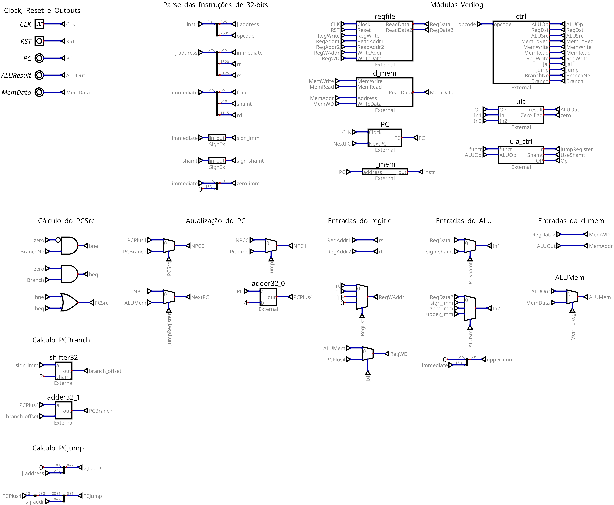
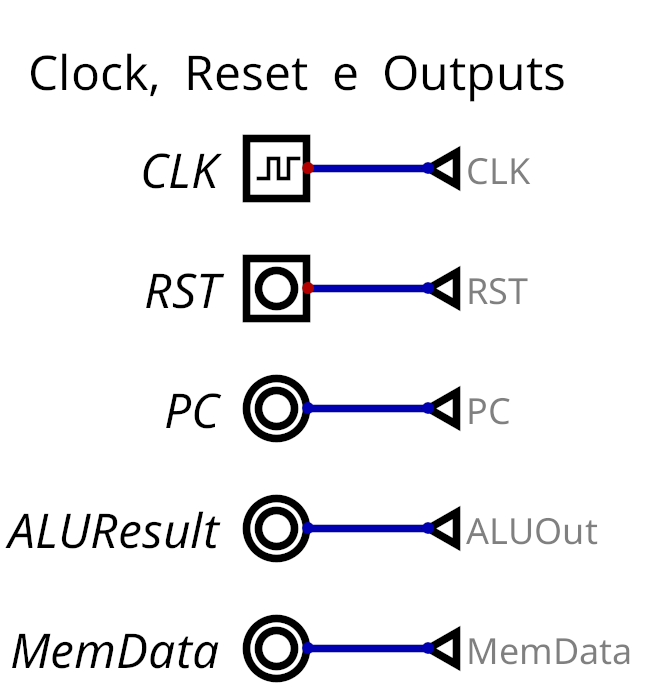
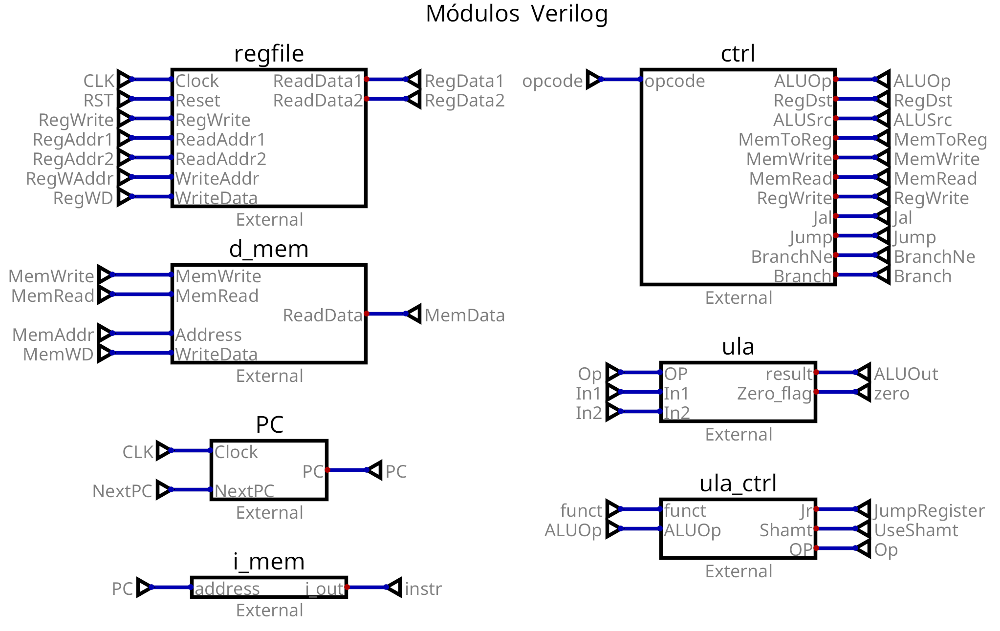
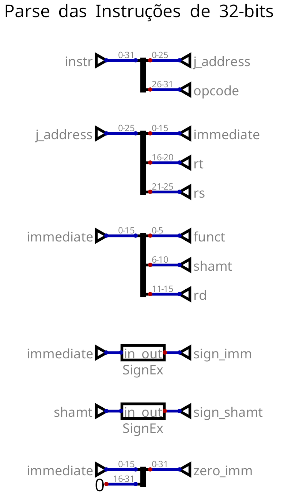
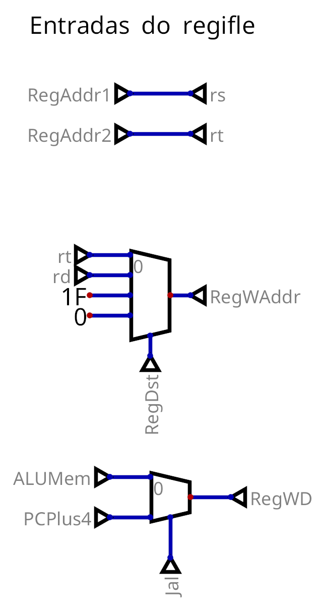

# MIPS Verilog

Implementação de um sub-conjunto das instruções do MIPS 32 em Verilog. Esse documento descreve alguns detalhes da implementação bem como a conexão dos vários módulos.



# Descrição do Projeto no Digital

Inicialmente, definimos as entradas CLOCK (**CLK**) e RESET (**RST**), e as saídas **PC**, **ALUResult** e **MemData**. Esses são as entradas e saídas necessárias para a produção do Top-Level MIPS (que foi gerada diretamente do Digital).



Em seguida, adicionamos os 7 módulos Verilog solicitados no documento de requisitos (OBS:. o módulo Top-Level foi gerado de forma automático pelo digital e testado/compilado posteriormente com o Icarus Verilog). Para cada uma das entradas e saídas, adicionamos um *fio nomeado* (para que possa ser utilizado posteriormente em outras partes).



A partir daí, separamos os campos das instruções e iniciamos a definição das entradas que devem ser recebidas por cada um dos módulos.

Para as instruções, simplesmente separamos os campos utilizando Mergers/Splitters (em Verilog, simplesmente a concatenação e seleção dos bits do fio). Nessa etapa, também já calculamos algumas extensões para o campo imediato (zero-extension e sign-extension) e shamt (sign-extension).



Para o regfile, os registradores de leitura são sempre determinados pelo *rs* e *rt*. Já o registrador de saída precisa ser selecionado através de um multiplexador e do sinal de controle emitido pela unidade de controle. Por último, o valor a ser escrito no registrador com endereço *RegWAddr* é selecionado através do sinal de controle *Jal* emitido pela unidade de controle (caso seja uma instrução jal, devemos salvar o PC + 4).



# Principais Módulos

## MIPS Top-level

O Módulo MIPS contém a organização de todos os outros módulos (além da definição de módulos auxiliares) abstraindo o funcionamento do processador MIPS monociclo proposto.

| | |
| --- | --- |
| **CLK** (entrada) | Representa o clock |
| **RST** (entrada) | Indica se os registradores devem ser limpos (assíncrono) |
| **PC** (saída, 32-bits) | Indica o valor do PC atual |
| **ALUResult** (saída, 32-bits) | Indica o valor produzido na saída da ALU |
| **MemData** (saída, 32-bits) | Indica o valor de saída da memória de dados |

## Program Counter (PC)

O módulo PC é extremamente simples e é responsável pelas atualizações do PC ao longo da execução do processador.

```verilog
module PC(input Clock, 
          input [31:0] NextPC, 
          output reg [31:0] PC);

always @(posedge Clock) begin
  PC <= NextPC;
end

endmodule
```

## Register File (regfile)

O módulo regfile é responsável por armazenar os 32 registradores disponíveis aos processadores MIPS. Inicialmente, todos os registradores possuem valor $0$ e qualquer registrador pode ser acessado.

```verilog
module regfile (
        input Clock,
        input Reset,
        input RegWrite,
        input [4:0] ReadAddr1,
        input [4:0] ReadAddr2,
        input [4:0] WriteAddr,
        input [31:0] WriteData,
        output [31:0] ReadData1,
        output [31:0] ReadData2);

// ....
// ....

endmodule
```

## Instruction Memory (i_mem) e Data Memory (d_mem)

Ambos os módulos são implementadas como RAM's assíncronas simples que servem para o armazenamento de instruções e dados, respectivamente.

Em especial, a memória de instruções deve ser pré-carregada através de um arquivo com as instruções MIPS (em binário, 1 por linho). O nome padrão do arquivo é *instruction.list*, mas que pode ser alterado ao depender do cenário.

```verilog
module i_mem(
        input [31:0] address ,
        output reg [31:0] i_out
    );

    reg [31:0] instructions [255:0];

    initial begin
        $readmemb("instruction.list", instructions);
    end

    always @ (address) begin
        i_out = instructions[address >> 2]; /* Valores são múltiplos de 4 */
    end

endmodule

```

A memória de dados é bem similar, optamos por manter um pequeno espaço de memória e utilizar $256$ células endereçáveis que armazenam $32$ bits.

```verilog
module d_mem(
      input MemWrite,
      input MemRead,
      input [31:0] Address,
      input [31:0] WriteData,
      output [31:0] ReadData);

    // Memória RAM
    reg [31:0] RAM [255:0];
  
    // ....
    // ....

    // Leitura dos dados
    assign ReadData = (MemRead == 0) ? 32'b0 : RAM[Address];

endmodule
```

## Unidade de Controle (ctrl)

| | |
| --- | --- |
| **opcode** (entrada, 6 bits)| Opcode da instrução a ser executada.
| **ALUOp** (saída, 3 bits) | Determina a operação que deve ser realizada pela ALU (passada para o controle da ULA que deve decidir especificamente as operações) |
| **RegDst** (saída, 2 bits) | Identifica o registrador destino de uma operação. Em resumo: $0$ devemos escrever em *rt*; $1$ devemos escrever em *rd*; $2$ devemos escrever no registrador 31 (*ra*); $3$ não utilizado, escrever no registrador 0.
| **ALUSrc** (saída, 2 bits) | Determina a origem do segundo valor recebido pela ALU. |
| **MemToReg** (saída, 1 bit) | Determina se o conteúdo a ser escrito no registrador destino vem da memória. |
| **MemWrite** (saída, 1 bit) | Determina se um valor deve ser escrito na memória. |
| **MemRead** (saída, 1 bit) | Determina se um valor deve ser lido da memória. |
| **RegWrite** (saída, 1 bit) | Determina se um valor deve ser escrito no regfile. |
| **Jal** (saída, 1 bit) | Indica se essa é uma instrução *jal*. |
| **Jump** (saída, 1 bit) | Indica se essa é uma instrução *j*. |
| **BranchNe** (saída, 1 bit) | Indica se essa é uma instrução de *bne* .|
| **Branch** (saída, 1 bit) | Indica se essa é uma instrução de *beq*. |

### Controle da ULA (ula_ctrl)

| | |
| --- | --- |
| **funct** (entrada, 6 bits) | Campo *funct* da instrução. |
| **ALUOp** (entrada, 3 bits) | Flags da unidade de controle indicando a operação a ser realizada.
| **Jr** (saída, 1 bit) | Indica se essa é uma instrução *jr*. |
| **Shamt** (saída, 1 bit) | Indica se o primeiro valor da ULA deve ser o campo *shamt* |
| **OP** (saída, 4 bits) | Indica a operação realizada pela ULA |

| Valores do OP (binário) | Operação |
| --- | --- |
| $0000$ | **add** |
| $0001$ | **sub** |
| $0011$ | **and** |
| $0100$ | **nor** |
| $0101$ | **or** |
| $0110$ | **xor** |
| $0111$ | **shift left com shamt** |
| $1000$ | **shift left** |
| $1001$ | **unsigned shift right com shamt** |
| $1010$ | **unsigned shift right** |
| $1100$ | **signed shift right com shamt** |
| $1101$ | **signed shift right** |
| $1110$ | **slt** |
| $1111$ | **sltu** | 

## Unidade Lógica e Aritmética (ULA/ALU)

```verilog
module ula(
        input [3:0]	OP,
        input [31:0] In1, In2,
        output reg [31:0] result,
        output Zero_flag);

    assign Zero_flag = (result == 0);

    // ...
    // ...
    
endmodule
```

---
*Requisitos e mais informações sobre o projeto podem ser encontradas na pasta de [documentação](docs) desse repositório.*

Algumas referências utilizadas para a produção desse projeto podem ser encontradas em:

- [HARDWARE MODELLING OF A 32-BIT, SINGLE CYCLE RISC PROCESSOR USING VHDL](https://www.researchgate.net/publication/301694967_HARDWARE_MODELLING_OF_A_32-BIT_SINGLE_CYCLE_RISC_PROCESSOR_USING_VHDL)
- [Verilog Code for 16-bit RISC Processor](https://www.fpga4student.com/2017/04/verilog-code-for-16-bit-risc-processor.html)
- https://github.com/jmahler/mips-cpu
- https://github.com/mohamed-minawi/MIPS-Processor-Verilog
- https://github.com/ahegazy/mips-cpu